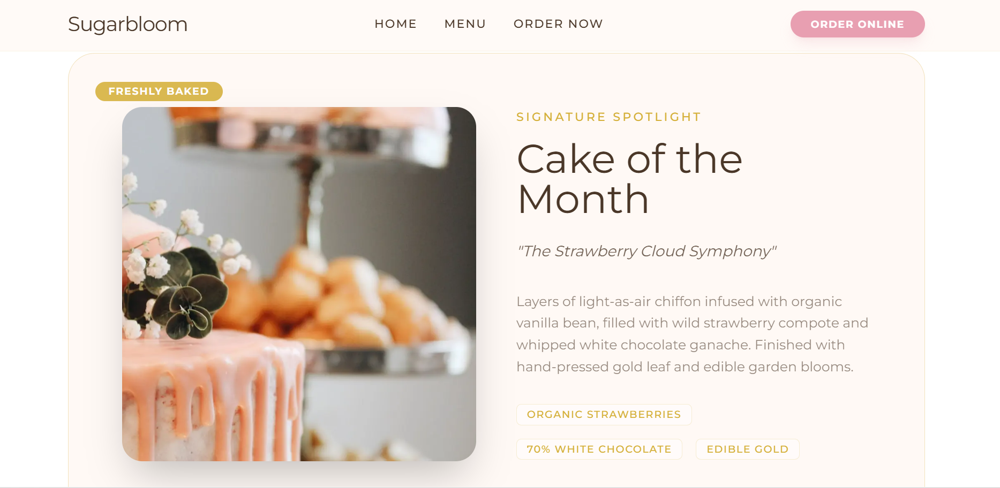
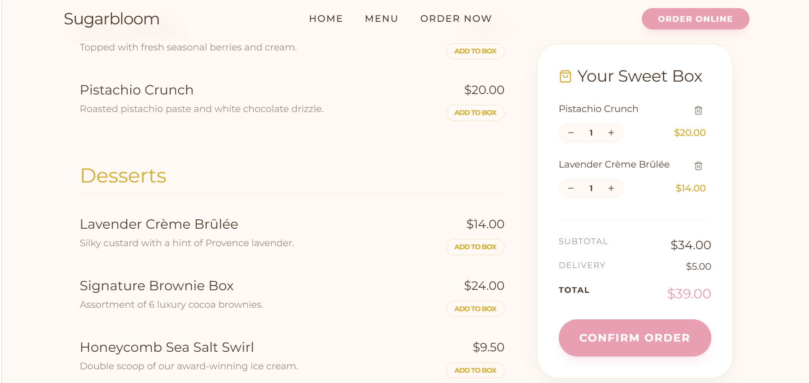
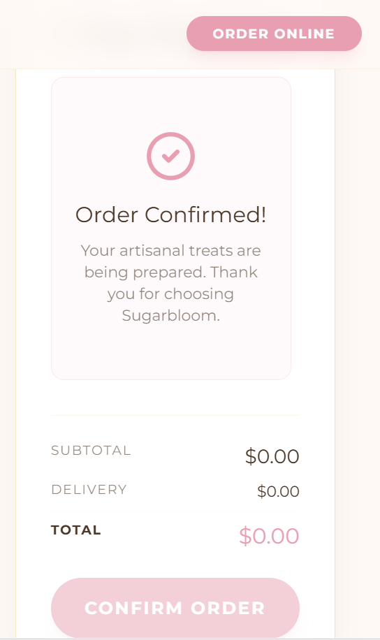
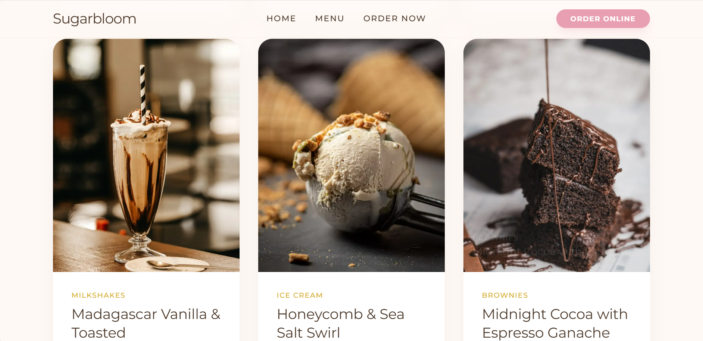

# AI-Dessert-Website-Showcase

A modern dessert-themed website created using BrainGrid AI through prompt-based website generation.

This project was built to practice AI-assisted UI/website creation and explore how AI tools can be used for modern frontend design workflows.

## 🌐 Live Demo

https://proj-1-a90d6360-9a55-4d84-8fe6-472ca04e40b6.bgridapp.com

## ✨ Features

- Modern dessert website UI
- Elegant landing page design
- Menu and ordering sections
- Clean layout and soft color palette
- AI-generated website structure
- Responsive visual design

## 🛠️ Built With

- BrainGrid AI
- Prompt Engineering
- UI/UX Design Concepts

## 📸 Screenshots

### Home Page

### Menu Page

### Order Section

### Cake Section

## 🎯 Purpose of Project

This project was created to:

- Practice AI website generation
- Learn prompt-based UI creation
- Explore modern website layouts
- Improve frontend design understanding

## 👩‍💻 Author

Nikita Maurya
